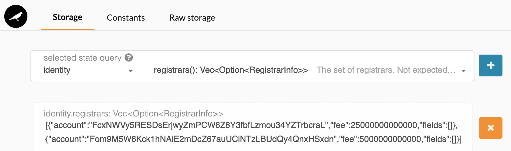
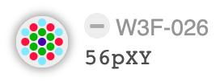
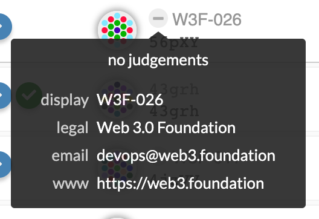
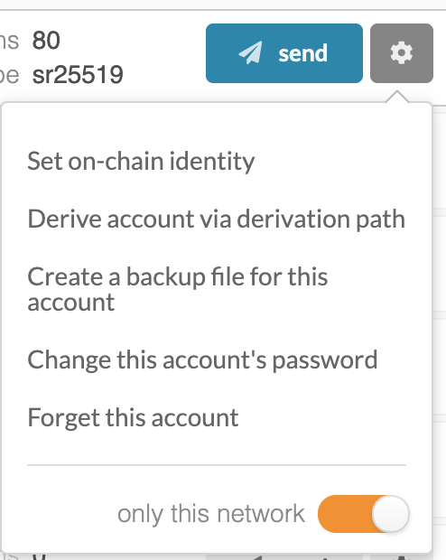
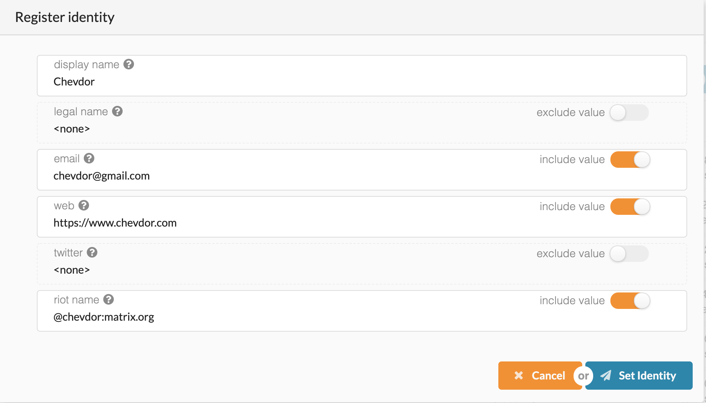
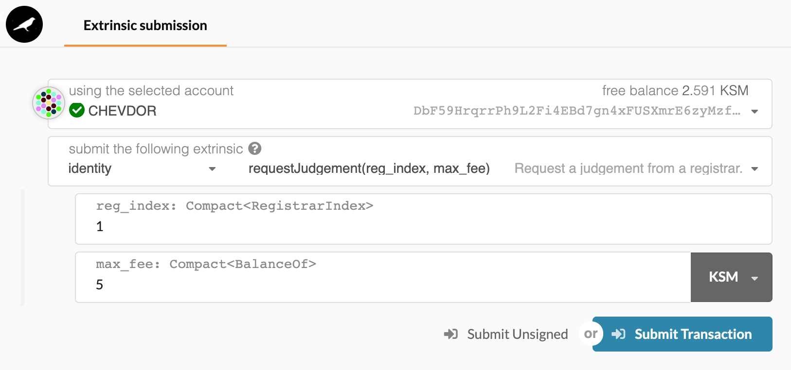
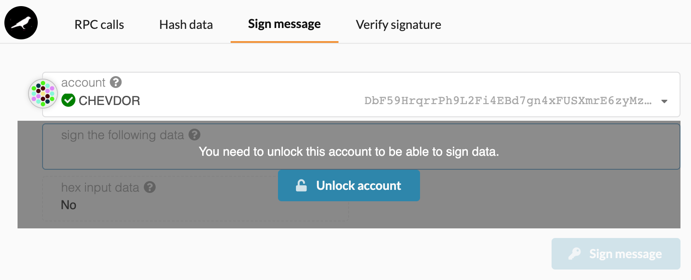
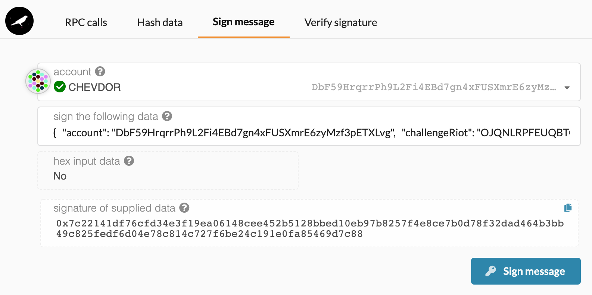
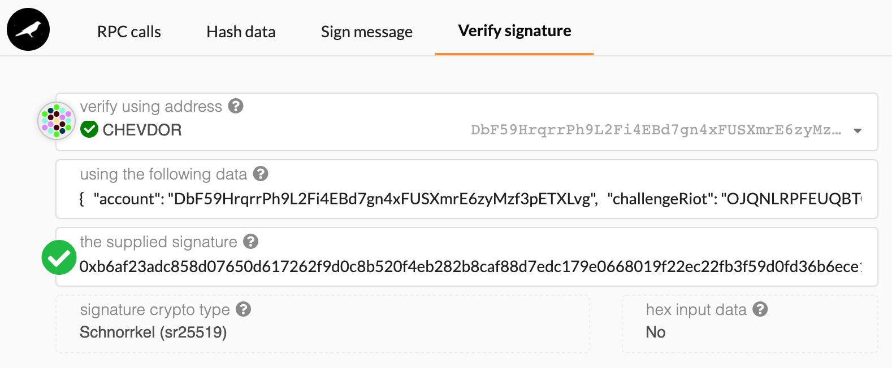
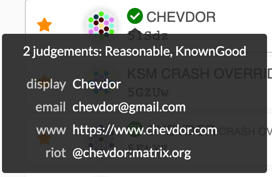

# Identidad en Kusama

Esta es una traducción de la [guía](https://www.chevdor.com/post/2020-01-registrar1/) del [blog de Chevdor](https://www.chevdor.com/) para verificar la identidad en [Kusama](https://polkadot.js.org/apps/#/explorer).

> _Gracias a Chevdor (`@chevdor:matrix.org` en RIOT) por su trabajo y su ayuda para la verificación de la identidad._

## Registro de Identidad Kusama #1 - ¿Por qué y cómo?

En un [artículo anterior](https://chevdor.com/post/2019-12-kusama-proposal1/), presenté una moción al Consejo de Kusama proponiendo el registro de un nuevo registrador en Kusama: `Registrar #1`.

A diferencia de lo que sugiere el nombre, este no es el primer registro de Kusama. Trae un segundo registro en la cadena como podemos ver al consultar el estado del módulo de identidad:

<p align="center"> 

</p>

---

### 1. TL;DR

Si sólo quiere realizar la práctica, ignore las explicaciones puede ir directamente al proceso de [certificación](#7-proceso-de-certificación).

---

### 2. ¿Qué hacen los registradores?

En primer lugar, dejemos claro que estamos hablando de un registrador de identidad. Su objetivo es verificar y certificar las identidades.

Si te familiarizaste con otras Blockchains, puedes empezar a hacer preguntas:

* ¿Puedo permanecer anónimo?

* ¿Es obligatorio definir una identidad como en todas las cadenas de bloques _permisionadas_?

Actualmente, las cuentas creadas en Kusama son pseudo anónimas. No es necesario proporcionar ningún dato personal para crear una cuenta. Esto es similar a crear cuentas en cadenas como Bitcoin o Ethereum.

¿Garantiza Polkadot el anonimato entonces?

No, en absoluto.

Después de crear una cuenta y almacenar su clave privada con cuidado, obtiene su dirección. Se parece a `Da3zQ7rLbxBazirv5NzK1WAv1VCbL68VGBq1Dv1k7fXC29f` para Kusama.

También está representado por un icono de identidad generado de manera única (identicon):

<p align="center"> 

</p>

Imagen 1. Icono de identidad para `Da3zQ7rLbxBazirv5NzK1WAv1VCbL68VGBq1Dv1k7fXC29f`
En este punto, esta cuenta es totalmente anónima pero tan pronto como una transacción (a menudo se oye el término _extrinsic_ en Polkadot) es enviada hacia o desde esta cuenta, puede empezar a ser capaz de rastrear hasta las otras cuentas. No es raro que los usuarios transfieran fondos y valor entre sus propias cuentas.

Kusama y Polkadot no ofrecen transacciones anónimas como las de una cadena como ZCash. No soporta _Zero Knowledge_ para su cadena principal, pero probablemente veamos puentes para cadenas como ZCash en el futuro.

¿Por qué renunciarías a este pseudo-anonimato?

Polkadot y Kusama ofrecen una novedad: el gobierno en cadena. En pocas palabras, significa que cualquiera puede, en la cadena, influir en cómo se comportará la cadena. Lo has oído bien, cualquier usuario puede proponer cambiar el funcionamiento de la cadena. Esto podría hacerse, por ejemplo, proponiendo cambiar el tiempo de ejecución actual con una nueva versión añadiendo/eliminando/cambiando características.

Considerando esto, ¿confiaría en nuestra cuenta pseudo-anónima creada anteriormente para tal modificación crítica? Probablemente no. Sin embargo, podría ayudar si se vinculase esta cuenta con una persona real con un historial probado y conocido.

Esto es lo que ofrece el módulo de identidad: Los usuarios que lo decidan pueden adjuntar información personal a su cuenta. Haciendo esto, la cuenta se mostrará de forma ligeramente diferente en la UI _(interfaz de usuario)_ de Polkadot:

<p align="center"> 

</p>
<p align="center">
Imagen 2. Cuenta de W3F-26
</p>

<p align="center"> 

</p>
<p align="center">
Imagen 3. Información de W3F-26
</p>

El propietario de la cuenta `DAT4gSgyMskggCmTQKfEM6hQgRy1NWdhtfMTAuPLsUAGUPy` decidió adjuntar cierta información.

¿Cuánto podemos confiar en esta información?

Ver la información anterior no tiene mucho valor, ya que cualquier usuario, relacionado o no con la fundación Web3, podría establecer una identidad similar.

Necesitamos una forma de comprobar, verificar y almacenar el resultado en la cadena. Esta es precisamente la misión de los registradores de identidad.

---

### 3. ¿Cuáles son las reglas del registro?

"¡Depende!" es probablemente la respuesta más apropiada. Cada registrador puede decidir cuándo y qué validar.

En el próximo capítulo, describiré las reglas del Registrador #1 y cómo se hacen cumplir.

---

### 4. Niveles de registro

La siguiente lista puede cambiar en el futuro pero aquí están los estados actuales que puede tomar en cuenta:

* Unknown

* FeePaid

* Reasonable

* KnownGood

* OutOfDate

* LowQuality

* Erroneous

---

### 5. Reglas del registrador #1

Kusama es una red experimental que permite desarrollar. Es por eso que las reglas de abajo pueden cambiar en el futuro.

Aquí están las reglas del Registro #1: - Se entrega en línea sólo el nivel "Razonable" - El nivel "KnownGood" podría ser concedido a cualquier persona que yo conozca y que pueda probar su nombre legal con al menos 2 documentos legales - Mientras que la exhibición y los nombres legales se comprobarán vagamente para la cordura y la coincidencia, no se realizará ninguna otra comprobación. Una cuenta con un nombre de usuario que obviamente no coincida con el nombre legal puede ser rechazada - Sólo se considerarán las cuentas con al menos un canal de comunicación (correo electrónico, riot, twitter, etc.) - Todos los canales de comunicación se verifican de forma independiente mediante desafíos. El nivel razonable sólo se concede a las cuentas que superen todas las pruebas. Más sobre eso abajo.

---

### 6. Desafíos

El principal objetivo de los desafíos es asegurar que el propietario de una cuenta determinada también controle el canal de comunicación. Esto ayuda a validar que la identidad no contiene ningún error de escritura, pero también que esos canales están activos y son válidos.

Cada canal de comunicación se verifica independientemente y recibe su propio reto.

Aquí una muestra de desafío:

```
{
  "account": "DbF59HrqrrPh9L2Fi4EBd7gn4xFUSXmrE6zyMzf3pETXLvg",
  "challengeRiot": "OJQNLRPFEUQBTCEL",
  "display": "Chevdor",
  "web": "https://www.chevdor.com",
  "riot": "@chevdor:matrix.org",
  "email": "chevdor@gmail.com"
}
```

---

### 7. Proceso de certificación

Este es el proceso de certificación actual para el Registrador Nº 1.

### 7.1. El usuario establece una identidad en la cadena

Mientras que se podría llamar a un _extrinsic_ directamente, la IU de Polkadot lo hace mucho más fácil.

Los usuarios sólo pueden establecer la identidad en cadena para sus propias cuentas, no es una sorpresa que la UI ofrezca un botón en la sección "Accounts":

<p align="center"> 

</p>
<p align="center">
Imagen 4. Realizando una llamada a  <code>setIdentity</code>
</p>

Haga clic en el botón "Establecer la identidad de la cadena" y aparecerá el siguiente diálogo: `Set on-chain Identity`

<p align="center"> 

</p>
<p align="center">
Imagen 5. <code>setIdentity</code>
</p>

>Nota: Es importante tener en cuenta que cualquier certificación de un registrador será anulada si la identidad de la cadena se modifica después de ser certificada por un registrador. Por lo tanto, es aconsejable comprobar de nuevo que todo es correcto.

Establecer la identidad en cadena actualmente requiere un depósito establecido en 10 KSMs. Esos fondos no van a ninguna parte, siguen siendo suyos pero están bloqueados en su cuenta mientras se establezca la identidad.

### 7.2. Juicio de la solicitud del usuario

El siguiente paso es solicitar a uno de los registradores que realice la verificación y emita un juicio.

Hasta ahora, el Registrador #1 nunca ha proporcionado en línea ningún otro juicio que no sea 'Razonable' y trabaja con los usuarios para asegurar que se pueda alcanzar este nivel.

La solicitud de un juicio puede hacerse desde la sección de `Extrinsics` de la UI:

<p align="center"> 

</p>
<p align="center">
Imagen 6. setIdentity
</p>

Aquí tienes que prestar atención a algunos puntos:

* Asegúrese de solicitar DESDE la cuenta que quiere verificar

* Asegúrese de seleccionar el registrador (`reg_index`) que debe verificar su información

* Finalmente asegúrese de proporcionar la tasa correcta (`max_fee`) que coincida con la tasa requerida del registrador seleccionado.

El estado de verificación cambiará a: `"Judgement: requested"`

Actualmente, el proceso de verificación del registro se está automatizando pero sigue siendo manual hasta que esté operativo. ¡Estén atentos!

Este es el momento de contactar con el operador del registro. Para el Operador de Registro #1, puede enviar un mensaje privado en Riot.

### 7.3. Verificación interactiva

Al contactar con `@chevdor:matrix.org`, no es necesario proporcionar mucho: la dirección de su cuenta es suficiente. Después de todo, los datos ya están en la cadena.

Después de comprobar si la identidad establecida actualmente satisface los criterios de verificación para el Registrador #1, `@chevdor:matrix.org` generará diferentes retos para cada canal definido en la identidad.

> Advertencia: Los desafíos parecen muy similares pero NO son los mismos.

Una vez que reciba el desafío, tendrá que registrar la firma de este mensaje usando la UI de Polkadot.

Puedes hacerlo fácilmente desde la UI en: [https://polkadot.js.org/apps/#/toolbox/sign](https://polkadot.js.org/apps/#/toolbox/sign)

<p align="center"> 

</p>
<p align="center">
Imagen 7. Desbloquear la cuenta para firmar
</p>

> Advertencia: ¡Asegúrate de desbloquear la cuenta correcta!

Para cada canal, copie el desafío en el campo `"sign the following data"` y haga clic en el botón "Firmar mensaje" como se muestra a continuación:

<p align="center"> 

</p>
<p align="center">
Imagen 8. Firma de uno de los retos
</p>

Este proceso se hará para cada canal y tienes que devolver la firma que obtuviste **usando cada canal**. **DEBES** proveer la firma del desafío de correo electrónico usando tu correo electrónico, **DEBES** proveer la firma del desafío de twitter usando twitter, etc...

> Nota: Para permitir que el Registrador #1 se ponga en contacto con usted, tendrá que seguir a `@chevdor` durante el proceso de certificación.

En el lado del registro, sus firmas serán revisadas. Normalmente, el registrador les informa sobre el resultado de cada prueba en Riot.

Puedes hacer ese chequeo tú mismo.

La firma de:

```
{
  "account": "DbF59HrqrrPh9L2Fi4EBd7gn4xFUSXmrE6zyMzf3pETXLvg",
  "challengeRiot": "OJQNLRPFEUQBTCEL",
  "display": "Chevdor",
  "web": "https://www.chevdor.com",
  "riot": "@chevdor:matrix.org",
  "email": "chevdor@gmail.com"
}
```

El resultado usando la cuenta `DbF59HrqrrPh9L2Fi4EBd7gn4xFUSXmrE6zyMzf3pETXLvg` es: 

```
0xb6af23adc858d07650d617262f9d0c8b520f4eb282b8caf88d7edc179e0668019f22ec22fb3f59d0fd36b6ece1236002d87bbcbbe9168aa28c1377e5c3272e81
```

La comprobación con la [UI de Polkadot](https://polkadot.js.org/apps/#/toolbox/verify) se verá como se muestra a continuación:

<p align="center"> 

</p>
<p align="center">
Imagen 9. Firma de uno de los retos
</p>

### 7.4. Comisión del registro

Es importante señalar que ningún KSM es enviado al registro en ningún momento. **NO** debe enviar o transferir fondos. Se transferirá al registrador sólo una vez que haya terminado su trabajo. Después de todo, estamos usando un sistema sin confianza.

### 7.5. Certificación

No tienes nada que hacer para el proceso de certificación. Normalmente es cuestión de segundos hasta que el `extrinsic` es entregado a la red por el registrador.

En cuanto este `extrinsic` llegue a la red, su cuenta será decorada con la marca verde que permite reconocer las cuentas que han sido verificadas.

<p align="center"> 

</p>
<p align="center">
Imagen 11. Cuenta verificada
</p>

> Advertencia: Recuerde que, a partir de ahora, llamar a `setIdentity` y cambiar cualquier información anulará sus certificaciones actuales y tendrá que empezar de nuevo desde la sección de [juicio de solicitud](#72-juicio-de-la-solicitud-del-usuario) de usuario.


_Traducción realizada por [wimel | DelegaNetworks](https://github.com/wimel) desde [ColmenaLabs_svq](https://www.colmenalabs.org/)_.